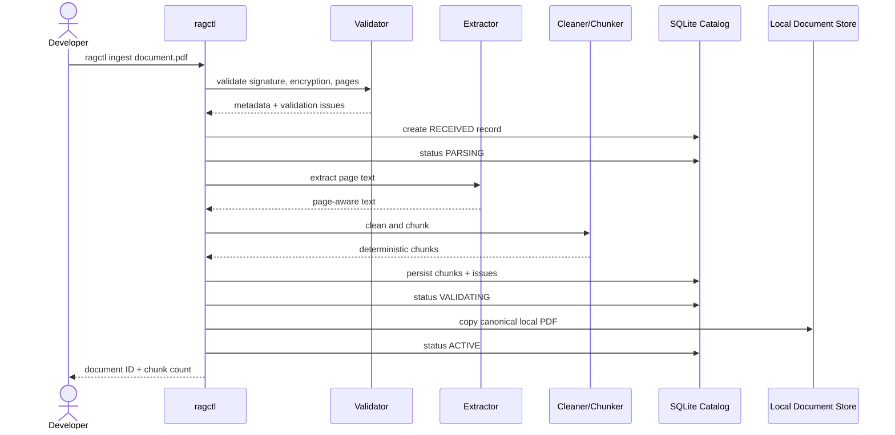
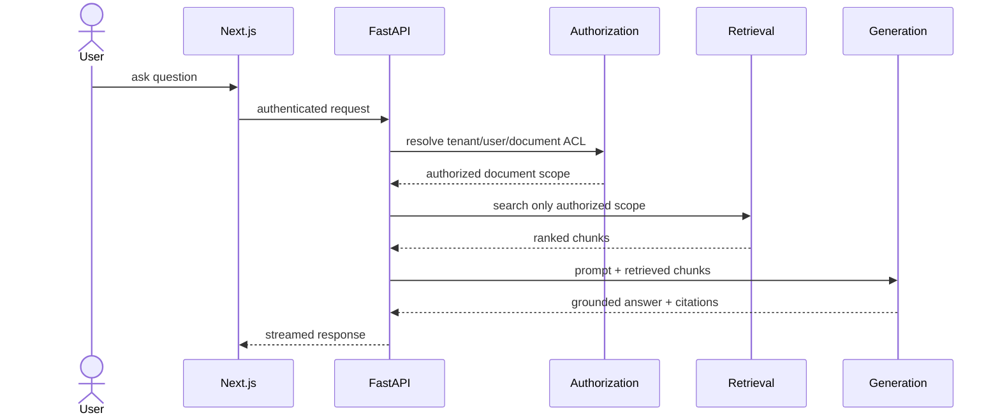

# Data Flow

## Phase 1 ingestion flow

## Failure path

A hard validation or extraction failure is persisted as an explicit issue and the document enters `FAILED_PARSE`. Low text density is currently a warning because sparse diagrams/manuals can still be valid.

## Future question flow

Unauthorized chunks must be excluded before the retrieval context is built.
