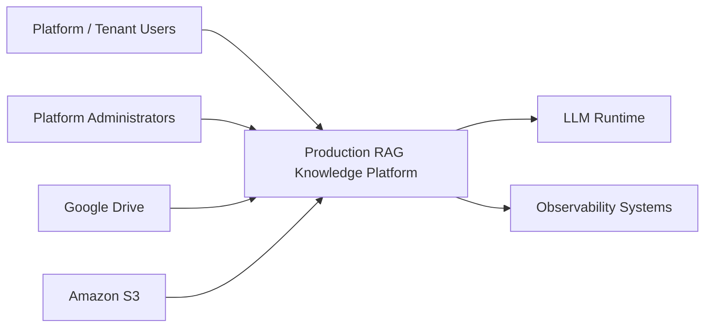
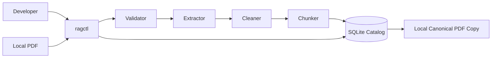

# System Context

## Product goal

The Production RAG Knowledge Platform is intended to become a secure, multi-tenant knowledge platform that ingests enterprise documents from manual upload, Amazon S3, and Google Drive and lets authorized users query only the content they are permitted to access.

Phase 0/1 deliberately implements only the architecture foundation and local PDF processing boundary.

## Actors

| Actor | Responsibility |
|---|---|
| Platform Admin | Operates the platform, global configuration, tenants, system health |
| Tenant Admin | Manages a tenant's users, roles, data sources, and permissions |
| Editor | Uploads/manages documents and queries authorized content |
| Viewer | Queries authorized content but cannot mutate documents |
| Service Account | Machine identity for ingestion/synchronization workflows |

## Target capabilities

- Authentication
- Tenant management
- User management
- Document management
- Document upload
- Document synchronization
- Document versioning
- Document permissions
- RAG chat
- Chat history
- Source citations
- Ingestion status
- Administration
- System health
- Audit history
- AI evaluation

## System context

## Phase 0/1 scope

No cloud deployment, vector database, LLM, authentication provider, or Kubernetes runtime is part of Phase 0/1 execution.
